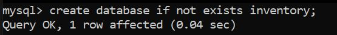
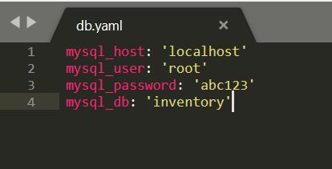
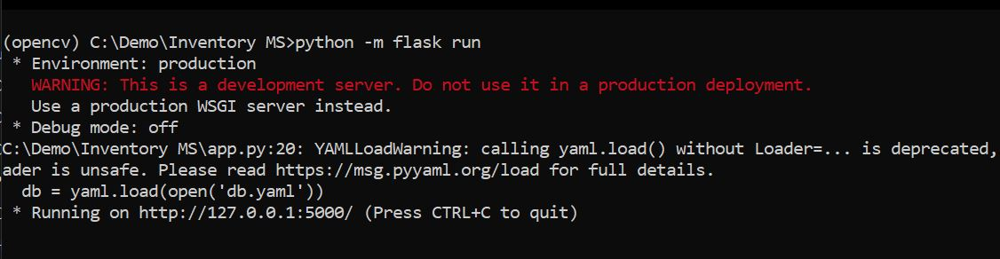
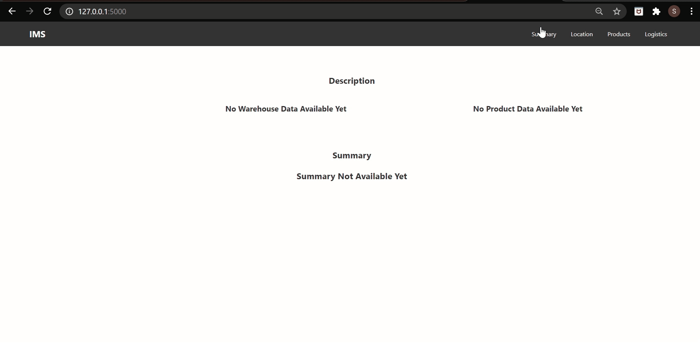
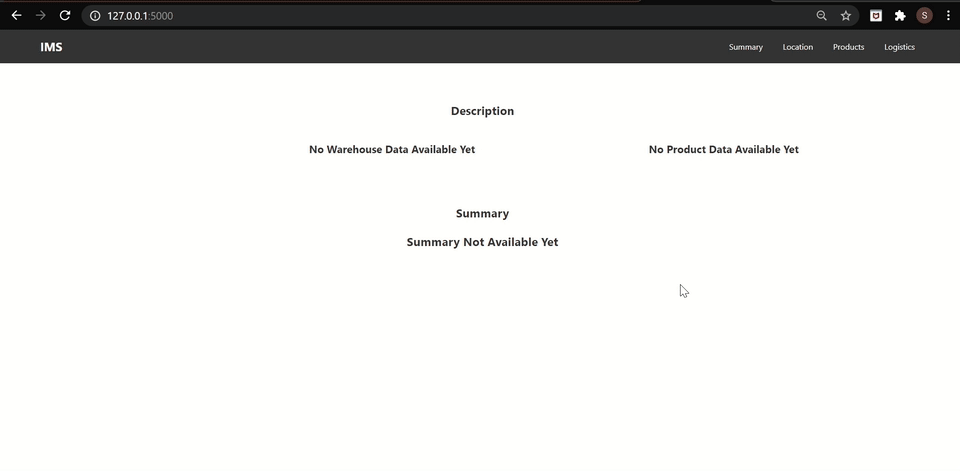
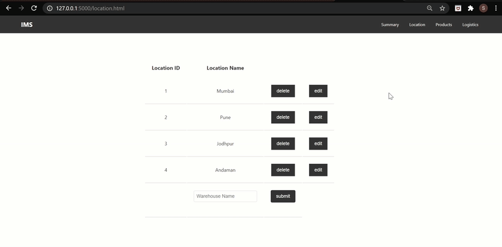
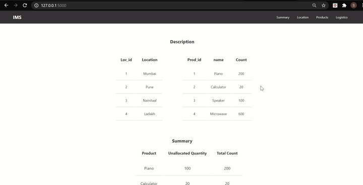
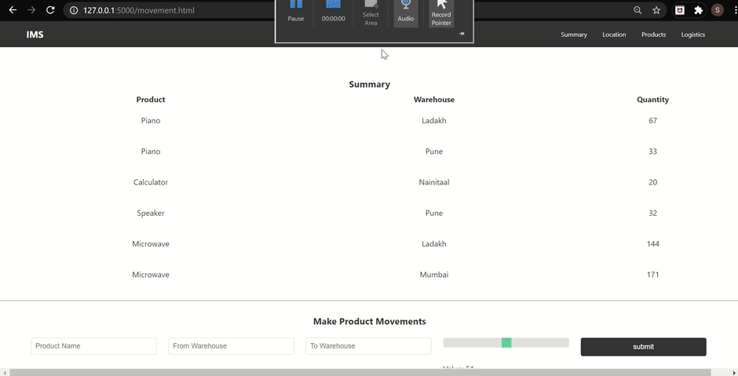
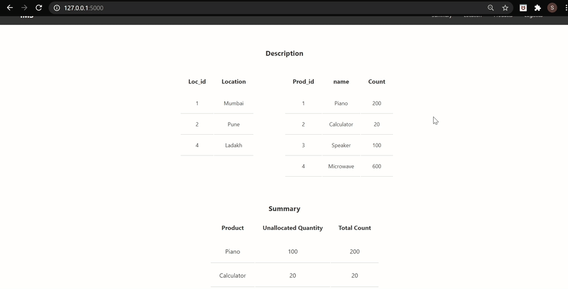

# A-Flask-web-app-for-inventory-management

*"An Inventory Management System powered by Flask"*

## Tech Stack

- Python
- Mysql
- Flask
- HTML
- CSS
- Jinja template

## Table of Contents

- [Installation](#installation)
- [Overview](#overview)
- [Usage](#usage)
    - [Setting up the database](#setting-up-the-database)
    - [Starting Things Up](#starting-things-up)
    - [Getting Into It](#getting-into-it)
        - [Adding products and locations](#adding-products-and-locations)
        - [Editing or deleting products and locations](#editing-or-deleting-products-and-locations)
        - [Moving things around](#moving-things-around)
- [License](#license)

## Installation

Clone the git repository:

```sourceCode console
$ git clone https://github.com/SASHA-PAIS/A-Flask-web-app-for-inventory-management.git

$ cd A-Flask-web-app-for-inventory-management
```

Install the necessary dependencies which include:

- flask
- flask_mysqldb
- yaml
- json
- MySQLdb
- decimal

## Overview

The _index/summary_ page covers the summary of the entire system as it includes the location and product information alongwith the count of the unallocated products. On the _products_ page, we can add/edit/remove products from the system. The _location_ page covers similar functionality in the context of locations or warehouses. We can perform movement of products on the _logistics_ page. It also maintains the history of the transactions in a tabular format.

## Usage

### Setting up the database

Create a database called inventory in mysql



Then create a db.yaml file in which you need to add the database name, mysql username, password and host name



### Starting Things Up

To run the application, make sure you are in the \~/A-Flask-web-app-for-inventory-management directory!

Run the app by typing the following command in your command prompt:

```sourceCode console
$ python -m flask run
```



or

```sourceCode console
$ python app.py
```

The application can be accessed at _localhost:5000_ in your browser


### Getting into it

A new system will look like this



#### Adding products and locations

To add products, only the name and quantity are required.
Adding locations needs only the name to be added



#### Editing products and locations

You can edit a location or product name if the new name is not empty or is not already present in the system. 

You can also increase the quantity of the product, but not decrease it. When this happens, the product quantity gets updated with the new quantity in the products table. Also, the unallocated quantity of that product also increases by the difference of the old product quantity and the new product quantity.



#### Moving things around

Products can be moved into and between warehouses *only after* they have been added to the system. 

Initially, we consider the products to not be in any warehouse. Hence, we keep the from_loc field empty 
and just enter the to_loc (destination) location. 

Once the products are in some warehouse, they can be moved easily to some other warehouse.



#### Deleting a location that has already been allocated some products

For all the products that currently exist in this particular location that has to be deleted, we first increase the unallocated quantities of these products by the quantity of the products that has been allocated in this location. 

Then, we delete the records from the logistics table where the to_loc & from_loc ids are the same as the location to be deleted. 

Then this location is deleted from the location table. 



#### Deleteing a product that has already been allocated

The record in the logistics table, where the prod_id is equal to the id of the product to be deleted, is removed first.

Then the product is deleted from the products table.



## License

This code has been released under the [MIT License](LICENSE).


